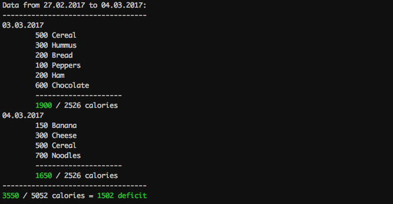

calories
=========

[](https://travis-ci.org/zupzup/calories)
[](https://goreportcard.com/report/github.com/zupzup/calories)


Calories is a commandline tool for tracking calories and weight using the [Harris Benedict](https://en.wikipedia.org/wiki/Harris%E2%80%93Benedict_equation) formula for calculating your BMR (Basal Metabolic Rate).

Features
---------



* Weight Timeline
* Day / Week / Month Overview
* Personalized Configuration
* Metric & Imperial Support 
* JSON Import / Export
* Optional JSON Output for all Commands
* History

Installation
-------------

Using Go:

```
go get github.com/zupzup/calories
```

Or with the released [Binaries](https://github.com/zupzup/calories/releases) for

* OS X (32-bit, 64 bit)
* Windows (32-bit, 64 bit)
* Linux (32-bit, 64 bit)

Getting Started
---------------

When you start `calories`, it will ask you where to put the `calories.db` file, which will store all of your data.

Then, it asks you to create your configuration using

```bash
calories config --weight=0.0 --height=0.0 --activity=0.0 --birthday=01.01.1970 --gender=female --unit=metric

// Example Metric
calories config --weight=88.0 --height=189.0 --activity=1.375 --birthday=02.09.1986 --gender=male --unit=metric

// Example Imperial (with shorthand flags)
calories config --w=226.0 --h=72.8 --a=1.55 --b=02.09.1986 --g=male --u=imperial
```

Expect for **Activity**, these parameters should be pretty self-explanatory. You can use both the metric or the imperial system, but you need to specify the one you are using in the configuration.

The Activity Setting depends on how much you exercise and needs to be set independent of the unit system based on this table:

| Amount of Exercise                    | Activity |
|---------------------------------------|----------|
| Little to no exercise	                |   1.2    |
| Light exercise (1–3 days per week)    |   1.375  |
| Moderate exercise (3–5 days per week) |   1.55   |
| Heavy exercise (6–7 days per week)    |   1.725  |
| Very heavy exercise	                |   1.9    |

After configuration you're all setup. Just typing `calories` will show you all entries of the current day.

You can add entries using e.g.: `calories add 150 apple`.

Usage
------

All commands follow the same structure:

```bash
calories [options] <commands> [<arguments...>]
```

You can use these commands to get an overview of all the different commands and information on how to use them:

```bash
calories -help

calories -commands

calories <command> -help
```

#### Adding an Entry

```bash
// Add an apple with 100 calories
calories add 100 Apple

// Add strawberries with cream 
calories add 300 "strawberries with cream"

// Add a Burger with 1000 calories 
calories add 1000 Burger

// Add an apple with 100 calories for a certain day
calories add --d=01.01.2017 100 Apple
```

#### Display Modes 

```bash
// Show the current day
calories

// Show a certain day
calories --d=01.01.2017

// Show the current week
calories --w

// Show the current month
calories --m

// Show the last 30 days
calories --h=30

// Show the last 1000 days
calories --h=1000
```

#### Clearing all entries on a Day 

The `clear` commands ask for your permission, before they actually delete anything.

```bash
// Clear the current day
calories clear

// Clear a specific day
calories clear --d=01.01.2017
```

#### Clearing a position inside an Entry 

```bash
// Clear the position on the current day (1-n)
calories clear --p=1

// Clear the position on the current day (1-n)
calories clear --d=01.01.2017 --p=1
```

#### View Weight Timeline 

```bash
// Show Weight Timeline
calories weight
```

#### Add Weight

```bash
// Add new weight on today's date
calories weight 85.0 
```

#### Configuration

If you set the configuration, after you already set it, the configuration is overwritten. However, you will get asked before this happens.

```bash
// Display the current configuration
calories config

// Example Metric
calories config --weight=88.0 --height=189.0 --activity=1.375 --birthday=02.09.1986 --gender=male --unit=metric

// Example Imperial (with shorthand flags)
calories config --w=226.0 --h=72.8 --a=1.55 --b=02.09.1986 --g=male --u=imperial
```

#### Export 

```bash
// Export all Data to backup.json
calories export > backup.json
```

#### Import 

Import does **NOT** ask your permission before overwriting data.

```bash
// Import all data from backup.json, OVERWRITING ALL DATA! 
calories import --f=backup.json 
```

#### JSON Output

All commands have a `--o` flag for JSON output, which makes it possible to easily integrate calories with other tools.

```bash
// Default is terminal
calories --o terminal

// And there is also JSON 
calories --o json
```

That's it - have fun! :)

Credit
-------

Renee French, For the Go Gopher the Logo is based on
